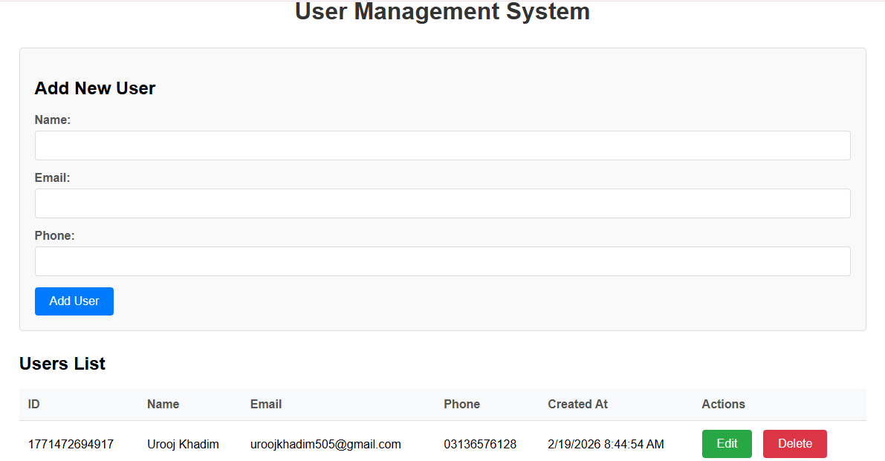

# Node.js CRUD Application

A simple CRUD (Create, Read, Update, Delete) application built with Node.js, featuring a basic HTML interface. The application supports both MySQL database and file-based storage options.

## Features

- Create new users with name, email, and phone
- Read/display all users in a table
- Update existing user information
- Delete users
- Form validation
- Responsive design

## Prerequisites

- Node.js (v14 or higher)
- npm (comes with Node.js)
- MySQL Server (optional, for MySQL version)

## Installation

1. Make sure you have Node.js installed on your system.

2. Clone or download this repository to your local machine.

3. Navigate to the project directory:
   ```bash
   cd nodejs-mysql-crud
   ```

4. Install dependencies:
   ```bash
   npm install
   ```

## Configuration Options

### Option 1: MySQL Database (requires MySQL Server)

1. Make sure your MySQL server is running.

2. Update the database credentials in `.env` file if needed:
   ```
   DB_HOST=localhost
   DB_USER=root
   DB_PASSWORD=your_password
   DB_NAME=crud_app
   DB_PORT=3306
   ```

3. Set up the database:
   ```bash
   npm run setup-db
   ```

### Option 2: File-Based Storage (no database required)

No additional setup required. Data is stored in JSON format in the `./data/` directory.

## Running the Application

### For MySQL Version:
```bash
npm start
```

### For File-Based Storage Version:
```bash
npm run start-file
```

Or for development with auto-restart:
```bash
npm run dev
```

Open your browser and navigate to `http://localhost:4000` (for file-based) or `http://localhost:3000` (for MySQL)

## Database (MySQL Option)
s
The application will automatically create:
- A database named `crud_app` (if it doesn't exist)
- A table named `users` with columns: id, name, email, phone, created_at

## API Endpoints

- `GET /` - Main page with user interface
- `GET /api/users` - Get all users
- `GET /api/users/:id` - Get user by ID
- `POST /api/users` - Create new user
- `PUT /api/users/:id` - Update user
- `DELETE /api/users/:id` - Delete user

## Project Structure

```
├── server.js                  # Main server file (MySQL version)
├── server_file_storage.js     # Alternative server file (file-based storage)
├── db_setup.js               # Database setup script
├── package.json              # Dependencies and scripts
├── .env                      # Environment configuration
├── data/                     # Directory for file-based storage
└── public/
    └── index.html            # Main HTML page with CRUD interface
```
ScreenShot
