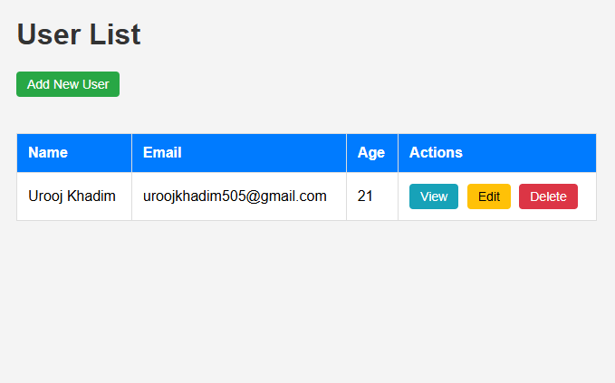
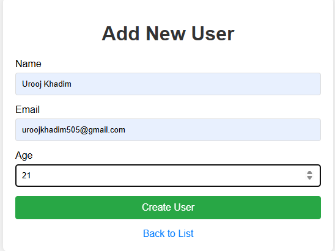
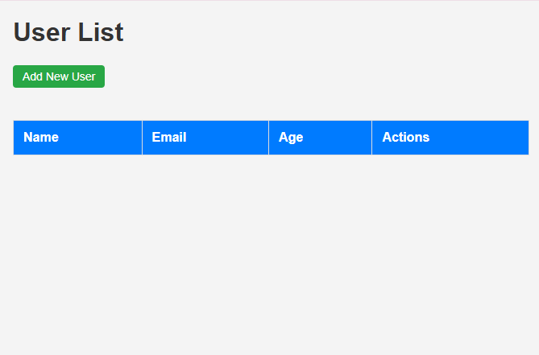

# Node.js + MongoDB CRUD Application

A simple, beginner-friendly CRUD application built with Node.js, Express, Mongoose, and basic HTML pages.

## Features
- **Create**: Add new users with name, email, and age.
- **Read**: View a list of all users and individual user details.
- **Update**: Edit existing user information.
- **Delete**: Remove users from the database.

## Prerequisites
- [Node.js](https://nodejs.org/) installed.
- [MongoDB](https://www.mongodb.com/) installed and running locally.

## Setup Instructions
1.  **Clone/Extract**: Ensure you are in the project root directory.
2.  **Install Dependencies**:
    ```bash
    npm install
    ```
3.  **Ensure MongoDB is Running**: The app connects to `mongodb://127.0.0.1:27017/crud_app` by default.
4.  **Start the Server**:
    ```bash
    npm start
    ```
5.  **Access the App**: Open your browser and navigate to `http://localhost:3000`.

## Screenshots

| User List Page | Add New User |
| :---: | :---: |
|  |  |

| Empty User List |
| :---: |
|  |

## Project Structure
- `server.js`: Main entry point and server configuration (Express + MongoDB).
- `models/User.js`: Mongoose schema for the User model.
- `routes/userRoutes.js`: API endpoints for CRUD operations.
- `public/`: Static HTML pages for the frontend.
    - `index.html`: Main page to list all users.
    - `create.html`: Form to add new users.
    - `edit.html`: Form to modify existing users.
    - `view.html`: Detailed view of a single user.

## Troubleshooting
If you see a "Database not connected" message in the UI:
1. Ensure your local MongoDB service is running.
2. If using MongoDB Atlas, check your connection string in `server.js`.
