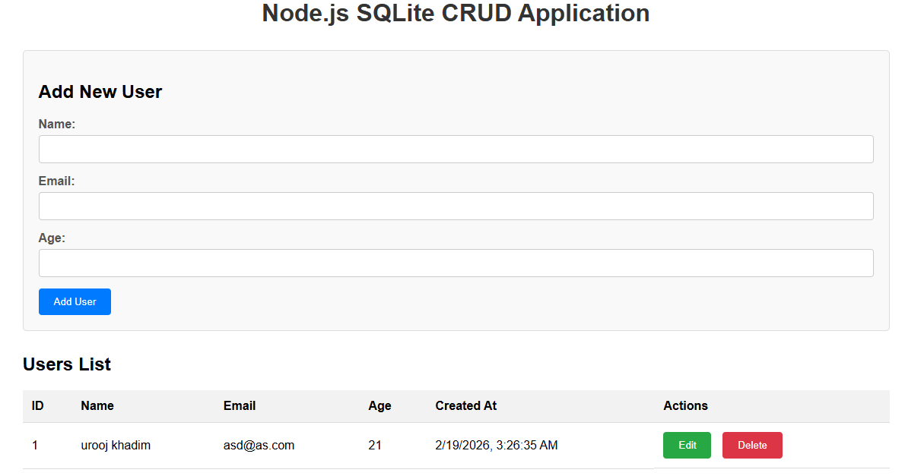

# Node.js SQLite CRUD Application

This is a simple Node.js application that demonstrates CRUD (Create, Read, Update, Delete) operations using SQLite as the database with a basic HTML interface.

## Features

- Create, Read, Update, and Delete users
- SQLite database integration
- Responsive HTML interface
- RESTful API endpoints
- Form validation
- Real-time data updates

## Database Schema

The application uses a single table called `users`:

```sql
CREATE TABLE users (
    id INTEGER PRIMARY KEY AUTOINCREMENT,
    name TEXT NOT NULL,
    email TEXT UNIQUE NOT NULL,
    age INTEGER,
    created_at DATETIME DEFAULT CURRENT_TIMESTAMP
);
```

## API Endpoints

- `GET /api/users` - Get all users
- `GET /api/users/:id` - Get a specific user
- `POST /api/users` - Create a new user
- `PUT /api/users/:id` - Update an existing user
- `DELETE /api/users/:id` - Delete a user

## Installation

1. Make sure you have Node.js installed on your system
2. Clone or download this repository
3. Navigate to the project directory
4. Install dependencies:

```bash
npm install
```

## Running the Application

Start the application using one of these methods:

### Production mode:
```bash
npm start
```

### Development mode (with auto-reload):
```bash
npm run dev
```

The application will be available at `http://localhost:3000`

## Usage

1. Open your browser and navigate to `http://localhost:3000`
2. Use the form to add new users
3. View, edit, or delete existing users from the table
4. All changes are saved to the SQLite database

## Dependencies

- express: Web framework for Node.js
- sqlite3: SQLite database driver
- body-parser: Parse incoming request bodies
Screen shot
