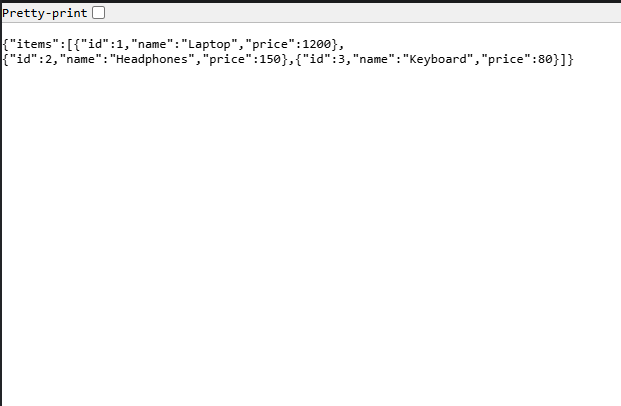

# Mini Online Store API (Express.js Lab Project)

Scalable Application Architecture using MVC and `express.Router`. This lab demonstrates:
- Global middleware (logger)
- Router-level middleware (auth for `/users`)
- Modular routing via `express.Router`
- Controllers for business logic
- 404 error handling

## Folder Structure
```
project-folder/
  app.js
  routes/
    products.js
    users.js
  controllers/
    productController.js
    userController.js
  middleware/
    logger.js
    auth.js
```

## Quick Start
1. Install dependencies:
   ```
   npm install
   ```
2. Run the server:
   ```
   node app.js
   ```
3. Server listens at:
   - http://localhost:3000/

## Endpoints
- GET `/` → health message
- GET `/products` → returns dummy items
- GET `/users/:id` → requires auth header, returns user by id
- POST `/users` → requires auth header, accepts JSON body and returns created user

### Auth Header
Router-level protection is applied only to `/users` routes.
- Send header: `Authorization: Bearer demo-token`

### Examples
Using curl (bash):
```
curl http://localhost:3000/products
curl -H "Authorization: Bearer demo-token" http://localhost:3000/users/123
curl -H "Authorization: Bearer demo-token" -H "Content-Type: application/json" \
     -d '{"name":"Alice"}' http://localhost:3000/users
```

On PowerShell:
```
curl.exe http://localhost:3000/products
curl.exe -H "Authorization: Bearer demo-token" http://localhost:3000/users/123
curl.exe -H "Authorization: Bearer demo-token" -H "Content-Type: application/json" `
        -d '{\"name\":\"Alice\"}' http://localhost:3000/users
```

## Restaurant Analogy
- Express App = The restaurant building
- Middleware (logger/auth) = The waiter checking orders or reservations
- Routers = Menu sections guiding orders to the right area
- Controllers = The chef preparing the dish (response)

## Why `express.Router()`?
- Keeps `app.js` focused on bootstrapping
- Separates features (products/users) for clean, scalable code
- Improves readability, testability, and maintenance as the app grows

## 404 Handling
Any unknown path returns:
```
{ "error": "Not Found" }
```
Screenshot


