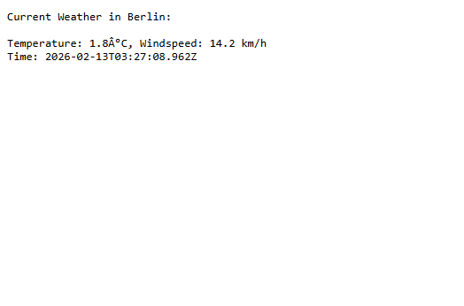

# Node.js Weather Application

A beginner-friendly Node.js project demonstrating core concepts including the Event Loop, Non-blocking I/O, Core Modules, and NPM package management.

## 📋 Project Overview

This application fetches real-time weather data from the Open-Meteo API, saves it to a local file, and serves it through an HTTP server. It's designed to illustrate fundamental Node.js concepts in a practical, hands-on way.

## 🎯 Learning Objectives

- **Node.js Architecture**: Understanding the Event Loop and how it handles asynchronous operations
- **Non-blocking I/O**: Using asynchronous file system operations to prevent blocking
- **Core Modules**: Working with `http` and `fs` modules
- **NPM**: Installing and using third-party packages (axios)
- **Asynchronous Programming**: Using Promises and callbacks

## 🚀 Getting Started

### Prerequisites

- Node.js (v12 or higher)
- npm (comes with Node.js)

### Installation

1. **Clone or navigate to the project directory**
   ```bash
   cd Assignment1
   ```

2. **Initialize the project** (if not already done)
   ```bash
   npm init -y
   ```

3. **Install dependencies**
   ```bash
   npm install axios
   ```

### Running the Application

1. **Start the server**
   ```bash
   node index.js
   ```

2. **Expected console output**
   ```
   --- Start of Script ---
   --- End of Script (Main Thread) ---
   Notice how this log appears BEFORE weather data is fetched or saved due to non-blocking I/O.
   Server is running on http://localhost:3000
   Weather data fetched successfully.
   Weather data saved to weather_log.txt
   ```

3. **Access the weather data**
   - Open your browser and navigate to: `http://localhost:3000`
   - You should see the current weather information for Berlin

## 📁 Project Structure

```
Assignment1/
├── index.js           # Main application file
├── package.json       # Project configuration and dependencies
├── package-lock.json  # Locked dependency versions
├── weather_log.txt    # Generated weather data file
└── README.md          # This file
```

## 🔍 How It Works

### 1. **Fetching Weather Data (Asynchronous Operation)**
```javascript
axios.get(WEATHER_API_URL)
  .then(response => {
    // Process weather data
  })
```
- Uses `axios` to make an HTTP GET request to the Open-Meteo API
- The request is non-blocking - the Event Loop handles it asynchronously
- The main thread continues executing without waiting for the response

### 2. **File System Operation (Non-blocking I/O)**
```javascript
fs.writeFile('weather_log.txt', logData, (err) => {
  // Callback executes after write completes
})
```
- Uses `fs.writeFile()` (asynchronous) instead of `fs.writeFileSync()` (blocking)
- Prevents blocking the Event Loop while writing to disk
- Callback runs when the operation completes

### 3. **HTTP Server (Event-driven)**
```javascript
const server = http.createServer((req, res) => {
  // Handle incoming requests
})
```
- Creates a server that listens on port 3000
- Uses event-based architecture to handle requests
- Reads and serves the weather data from `weather_log.txt`

## 🔄 Event Loop Demonstration

Notice the console output order:
1. "Start of Script" - logged first
2. "End of Script (Main Thread)" - logged second
3. "Server is running..." - logged third
4. "Weather data fetched..." - logged last

This demonstrates how the Event Loop handles asynchronous operations without blocking the main thread.

## 📊 Weather Data

The application fetches the following information:
- **Temperature** (in Celsius)
- **Wind Speed** (in km/h)
- **Timestamp** (when the data was fetched)

**Location**: Berlin, Germany (Latitude: 52.52, Longitude: 13.41)

## 🛠️ Technologies Used

- **Node.js**: JavaScript runtime environment
- **axios**: Promise-based HTTP client for making API requests
- **http**: Node.js core module for creating HTTP servers
- **fs**: Node.js core module for file system operations

## 📝 Key Concepts Explained

### Event Loop
The Event Loop is what allows Node.js to perform non-blocking I/O operations despite JavaScript being single-threaded. It continuously checks the call stack and callback queue, executing callbacks when the stack is empty.

### Non-blocking I/O
Instead of waiting for I/O operations (like file reads/writes or network requests) to complete, Node.js uses callbacks and continues executing other code. This makes Node.js highly efficient for I/O-intensive applications.

### Callbacks vs Promises
- **Callbacks**: Functions passed as arguments to be executed later (used in `fs.writeFile`)
- **Promises**: Objects representing eventual completion/failure of async operations (used with `axios`)

## 🔧 Customization

### Change Location
Modify the latitude and longitude in the API URL:
```javascript
const WEATHER_API_URL = 'https://api.open-meteo.com/v1/forecast?latitude=YOUR_LAT&longitude=YOUR_LON&current_weather=true';
```

### Change Port
Modify the PORT constant:
```javascript
const PORT = 3000; // Change to your preferred port
```

## 🐛 Troubleshooting

### Port Already in Use
If you see an error about port 3000 being in use:
- Change the PORT variable to a different number (e.g., 3001)
- Or stop the process using port 3000

### Cannot Find Module 'axios'
Run the installation command:
```bash
npm install axios
```

### No Weather Data Displayed
- Ensure you've run the application and waited a few seconds for the API call to complete
- Check that `weather_log.txt` was created in the project directory
- Verify your internet connection

## 📚 Further Learning

- [Node.js Official Documentation](https://nodejs.org/docs/)
- [Understanding the Event Loop](https://nodejs.org/en/docs/guides/event-loop-timers-and-nexttick/)
- [Asynchronous Programming in Node.js](https://nodejs.dev/learn/asynchronous-programming-and-callbacks)
- [NPM Documentation](https://docs.npmjs.com/)

## 📄 License

ISC

## 👨‍💻 Author

Created for educational purposes - Node.js Theory Class 
